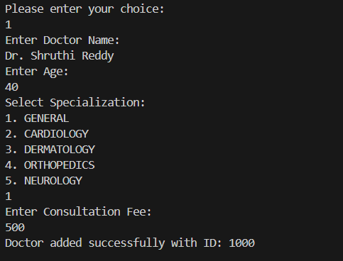
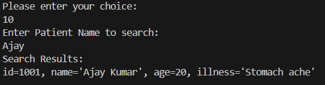
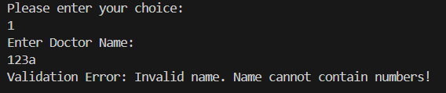
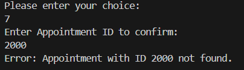
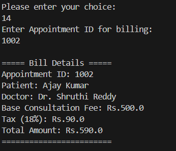

# MediTrack - Clinic & Appointment Management System

A simple Java console application to manage doctors, patients, appointments, and billing operations.

## Prerequisites

- Java Development Kit (JDK) 11 or higher
- Windows PowerShell / Command Prompt / Terminal

## Setup

### Step 1: Verify Java Installation

```bash
java -version
javac -version
```

You should see JDK 11 or higher.

### Step 2: Compile & Run the Project

From the project root directory, run the following commands in terminal:

Compile all Java files using the below command
```bash
javac -d bin -sourcepath src src/com/airtribe/meditrack/Main.java    
```
Run all Java files using the below command
```bash
java -cp bin com.airtribe.meditrack.Main
```

## Usage

The app shows an interactive menu in the console. Choose an option and follow the prompts.

### Main Menu

```
===== Welcome to MediTrack - Clinic & Appointment Management System =====
1. Add a Doctor
2. Add a Patient
3. Schedule an Appointment
4. View all Doctors
5. View all Patients
6. View all Appointments
7. Confirm an Appointment
8. Cancel an Appointment
9. Search Doctors by Name
10. Search Patients by Name
11. Delete a Patient
12. Delete a Doctor
13. Average Consultation Fee of Doctors
14. Generate Bill
0. Exit
```

## Sample Run Output

### 1. Adding a Doctor

```
Please enter your choice:
1
Enter Doctor Name:
Dr. Shruthi Reddy
Enter Age:
45
Select Specialization:
1. GENERAL
2. CARDIOLOGY
3. DERMATOLOGY
4. ORTHOPEDICS
5. NEUROLOGY
2
Enter Consultation Fee:
500
Doctor added successfully with ID: 1001
```

### 2. Adding a Patient

```
Please enter your choice:
2
Enter Patient Name:
Rohan
Enter Age:
30
Enter Illness:
Fever
Patient added successfully with ID: 2001
```

### 3. Scheduling an Appointment

```
Please enter your choice:
3
Enter Patient ID:
2001
Enter Doctor ID:
1001
Appointment scheduled successfully with ID: 3001
```

### 4. Confirming an Appointment

```
Please enter your choice:
7
Enter Appointment ID to confirm:
3001
Appointment confirmed successfully!
```

### 5. Generating a Bill

```
Please enter your choice:
14
Enter Appointment ID for billing:
3001

===== Bill Details =====
Appointment ID: 3001
Patient: Rohan
Doctor: Dr. Shruthi Reddy
Base Consultation Fee: Rs.500.0
Tax (18%): Rs.90.0
Total Amount: Rs.590.0
========================
```

### 6. Searching Patients by Name

```
Please enter your choice:
10
Enter Patient Name to search:
Rohan
Search Results:
id=2001, name='Rohan', age=30, illness='Fever'
```

### 7. Validation Error Example

```
Please enter your choice:
2
Enter Patient Name:
Rohan123
Validation Error: Invalid name. Name cannot contain numbers!
```

### 8. Exception Handling Example

```
Please enter your choice:
7
Enter Appointment ID to confirm:
9999
Error: Appointment with ID 9999 not found.
```

## Key Design Features

- **Object-Oriented Design**: Inheritance, interfaces, and polymorphism
- **Singleton Pattern**: IdGenerator ensures unique ID generation
- **Exception Handling**: Custom exceptions for domain-specific errors
- **Data Validation**: Input validation for names, ages, and other fields
- **Generic Data Store**: Type-safe storage for entities
- **Cloneable Pattern**: Deep copying for Patient objects in appointments
- **Enums**: Type-safe Specialization and AppointmentStatus
- **Streams & Lambdas**: Filtering and analytics with modern Java


## Demo (Sample Run)

### Adding a Doctor



### Searching for a Patient



### Validation example



### Error handling example



### Generating a Bill



## Manual Test Runner

From the project root directory, run the following commands in terminal:

```java
Step 1: Compile all Java files using the below command
javac -d bin -sourcepath src src/com/airtribe/meditrack/Main.java

Step 2: Run the test runner using the below command
java -cp bin com.airtribe.meditrack.test.TestRunner
```

## Documentation

For detailed information, refer to:
- [Setup Instructions](src/com/airtribe/meditrack/docs/Setup_Instructions.md)
- [Design Decisions](src/com/airtribe/meditrack/docs/Design_Decisions.md)
- [JVM Report](src/com/airtribe/meditrack/docs/JVM_Report.md)


