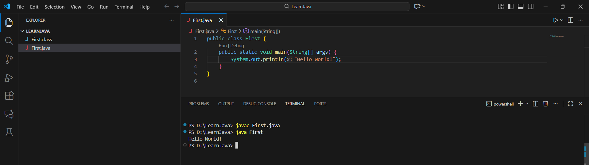

# Setup Instructions

## Java Installation
1. For this project, Java Development Kit (JDK) version 21 was used.
2. The JDK was installed from the official Oracle website and configured on the local system.
3. After installation, the JAVA_HOME environment variable was set and the JDK bin directory was added to the system PATH to allow Java commands to run from the terminal.

## Verifying Java Installation
To verify that the Java was installed correctly, a simple Hello World program was written and executed.

```java
// First Java Program
public class First {
    public static void main(String[] args) {
        System.out.println("Hello, World!");
    }
}
```

* The program was compiled using the command: 
  **'javac First.java'**
* The compiled program was executed using the command:
  **'java First'**
* The successful output confirmed that Java was installed and configured properly on the system.


